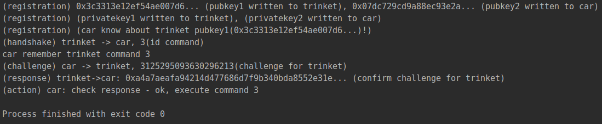
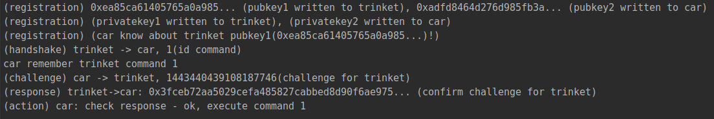
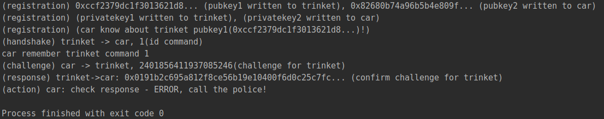

# tp_car_key
Автомобильный брелок  
Как запустить: go run main.go или ./main  
Выполнил: Романов Андрей  
Окружение: go1.16  
Описание работы:  
1.  Генерим private+public key для тачки и брелока
2.  Вшиваем в тачку ее приватный ключ, в брелок его приватный
3.  Вшиваем в тачку pub key брелока
4.  Со стороны брелока отправляем тачке команду(откройся, закройся, прогрейся и тд) на каждую команду свой код
5.  Тачка получает код от брелока и говорит: вот держи рандомное число, подпиши его своим private key  
6.  Брелок подписывает хеш от пришедшего рандома своим ключом, отправляет тачке обратно
7.  Тачка расшифровывает полученные данные, используя public key брелока
8.  Если успешно расшифровали, значит это наш брелок и выполняем его команду  
Успешное выполнение команды 0x03(прогрев)  

Успешное выполнение команды 0x01(открытие дверей)

Неуспешное выполнение команды 0x01(открытие дверей)(например подпись ключом от другого брелока)  

